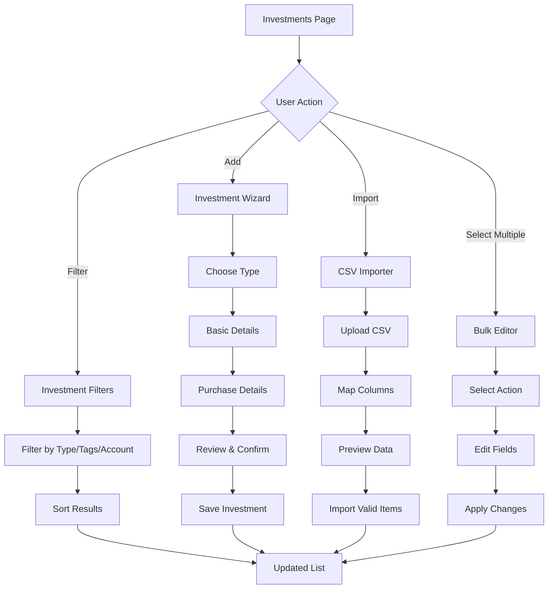
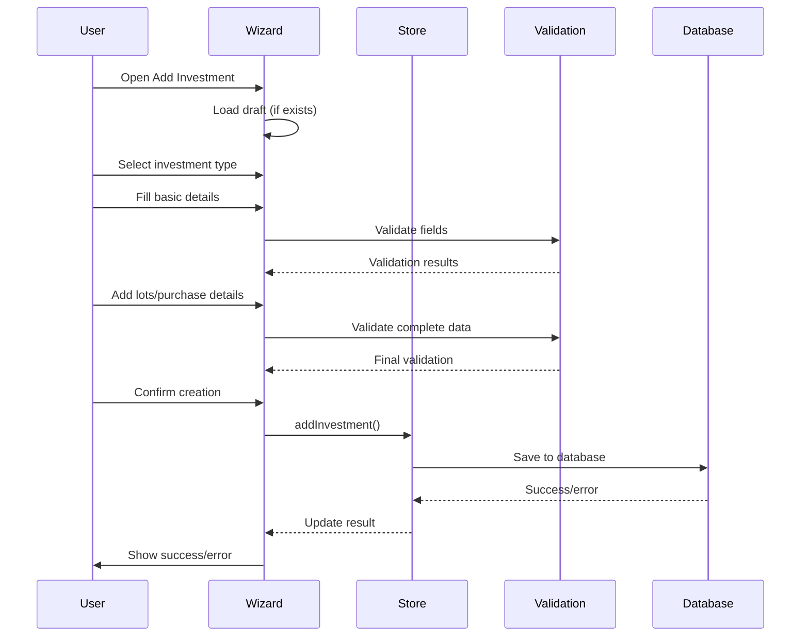
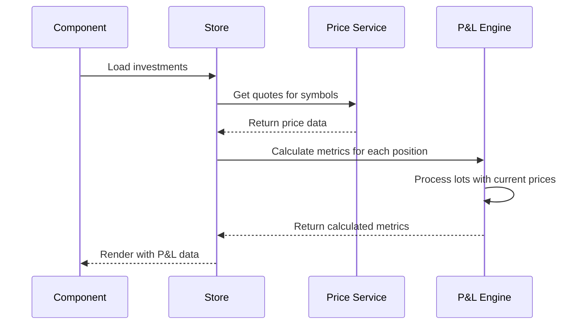

# Investments Feature Documentation

## Overview

The Investments feature is the heart of PortfolioHub, providing comprehensive investment tracking and management across multiple asset classes. It supports stocks, ETFs, options, cryptocurrencies, bonds, commodities, real estate, cash positions, and custom investments with detailed lot tracking, P&L calculations, and portfolio analytics.

## Table of Contents

1. [Architecture](#architecture)
2. [Data Models](#data-models)
3. [User Experience](#user-experience)
4. [Components](#components)
5. [State Management](#state-management)
6. [Calculations](#calculations)
7. [Import/Export](#importexport)
8. [Performance](#performance)
9. [Accessibility](#accessibility)
10. [Testing](#testing)
11. [Adding New Asset Types](#adding-new-asset-types)

## Architecture

### High-Level Structure
```
src/
├── pages/
│   └── Investments.tsx              # Main investments page
├── features/investments/
│   ├── store.ts                     # Zustand store
│   └── types.ts                     # TypeScript types
├── components/investments/
│   ├── InvestmentCard.tsx           # Individual investment display
│   ├── InvestmentFilters.tsx        # Advanced filtering
│   ├── AddInvestmentWizard.tsx      # Multi-step creation flow
│   ├── FieldRenderer.tsx            # Dynamic form fields
│   ├── LotsEditor.tsx              # Lot management
│   ├── CsvImporter.tsx             # CSV import functionality
│   ├── BulkEditor.tsx              # Bulk operations
│   └── VirtualizedInvestmentList.tsx # Performance optimization
├── schemas/investments/
│   ├── base.ts                      # Common schemas
│   ├── stock.ts                     # Stock-specific schemas
│   ├── option.ts                    # Option-specific schemas
│   └── [other asset types].ts      # Asset-specific schemas
└── lib/
    ├── plCalculations.ts            # P&L calculation engine
    └── investmentValidation.ts      # Validation utilities
```

## Data Models

### Core Types

#### Investment Base
```typescript
interface BaseInvestment {
  id: string
  type: InvestmentType
  symbol: string
  displayName?: string
  account?: string
  tags?: string[]
  notes?: string
  privacy: {
    showPosition: boolean
    showLots: boolean
    showPnL: boolean
  }
  lots: Lot[]
  createdAt: string
  updatedAt: string
}
```

#### Lot Structure
```typescript
interface Lot {
  id: string
  quantity: number
  price: number
  fees?: number
  date: string
  notes?: string
}
```

### Asset-Specific Extensions

Each asset type extends the base investment with specific fields:

- **Stocks/ETFs**: `dividendReinvestment`, `expenseRatio`
- **Options**: `optionType`, `strike`, `expiration`, `underlying`, `contracts`
- **Crypto**: `currency`, `network`, `stakingRewards`, `stakingApy`
- **Bonds**: `issuer`, `coupon`, `maturity`, `faceValue`, `creditRating`
- **Real Estate**: `propertyType`, `purchasePrice`, `equityPercentage`, `monthlyRent`
- **Cash**: `currency`, `interestRate`, `institution`
- **Custom**: `category`, `valueModel`, `customFields`

## User Experience

### Investment Management Flow



### Key User Journeys

1. **Adding a Stock Investment**
   - Select "Stock" type
   - Enter symbol and basic details
   - Choose entry method (single, average, or multiple lots)
   - Add purchase details and fees
   - Review and confirm

2. **Managing Lots**
   - Open investment detail view
   - Use LotsEditor to add/edit/delete lots
   - View real-time P&L calculations
   - Track cost basis changes

3. **Bulk Operations**
   - Select multiple investments
   - Choose bulk action (tags, privacy, account, delete)
   - Apply changes to all selected items

4. **CSV Import**
   - Download template or prepare CSV
   - Upload and map columns
   - Preview and validate data
   - Import valid records

## Components

### InvestmentCard
Displays individual investment with:
- Asset type badge and privacy indicators
- Current value and P&L (both unrealized and today's change)
- Visual indicators for gains/losses
- Asset-specific details (options expiration, real estate metrics, etc.)

### AddInvestmentWizard
Multi-step wizard with:
- **Step 1**: Asset type selection
- **Step 2**: Basic details (dynamic form based on type)
- **Step 3**: Purchase details (lots entry)
- **Step 4**: Review and confirmation

Features:
- Auto-save drafts to localStorage
- Real-time validation with Zod schemas
- Responsive design for mobile
- Confirmation before closing with unsaved changes

### LotsEditor
Comprehensive lot management with:
- Position summary with key metrics
- Sortable/filterable lots table
- Add/edit/delete individual lots
- Real-time P&L calculations
- FIFO cost basis tracking

### FieldRenderer
Dynamic form component that renders fields based on investment type:
- Supports all input types (text, number, date, select, checkbox)
- Built-in validation and error display
- Conditional field rendering
- Accessibility features

### CsvImporter
Three-step import process:
- **Upload**: File selection with template download
- **Mapping**: Column mapping with validation
- **Preview**: Data validation and error reporting
- **Import**: Batch processing with results summary

### BulkEditor
Supports bulk operations on selected investments:
- Tag management (add, remove, replace)
- Privacy settings updates
- Account assignment
- Bulk deletion with confirmation

## State Management

### Zustand Store Structure
```typescript
interface InvestmentsState {
  // Core data
  investments: Investment[]
  isLoading: boolean
  error: string | null
  
  // Computed values
  totalValue: number
  totalPnL: number
  todayChange: number
  
  // UI state
  searchQuery: string
  filters: InvestmentFilters
  selectedInvestments: string[]
  drafts: Record<string, InvestmentDraft>
  
  // Actions
  load: () => Promise<void>
  addInvestment: (investment) => Promise<void>
  updateInvestment: (id, updates) => Promise<void>
  deleteInvestment: (id) => Promise<void>
  bulkUpdate: (ids, updates) => Promise<void>
  bulkDelete: (ids) => Promise<void>
  
  // Draft management
  saveDraft: (draftId, draft) => void
  loadDraft: (draftId) => InvestmentDraft | null
  clearDraft: (draftId) => void
}
```

### Draft Management
- Auto-save every 30 seconds
- Persist to localStorage for browser refresh recovery
- Clear on successful submission
- Warn before closing with unsaved changes

## Calculations

### P&L Engine

The P&L calculation engine (`plCalculations.ts`) provides:

#### Lot-Level Metrics
```typescript
interface LotMetrics {
  costBasis: number           // quantity * price + fees
  currentValue: number        // quantity * currentPrice
  unrealizedPnL: number       // currentValue - costBasis
  unrealizedPnLPercent: number // (unrealizedPnL / costBasis) * 100
}
```

#### Position-Level Metrics
```typescript
interface PositionMetrics {
  totalQuantity: number
  totalCost: number
  avgCost: number            // totalCost / totalQuantity
  currentValue: number       // totalQuantity * currentPrice
  unrealizedPnL: number      // currentValue - totalCost
  unrealizedPnLPercent: number
  todayChange: number        // totalQuantity * (currentPrice - prevClose)
  todayChangePercent: number
}
```

#### FIFO Cost Basis
For tax lot matching and realized gains:
```typescript
function calculateFIFOCostBasis(lots: Lot[], sellQuantity: number): {
  costBasis: number
  remainingLots: Lot[]
  soldLots: { lot: Lot; quantitySold: number }[]
}
```

#### Asset-Specific Calculations

**Options**
- Breakeven calculations for calls/puts
- Maximum profit/loss scenarios
- Intrinsic vs. time value

**Bonds**
- Yield to maturity (YTM)
- Current yield
- Duration and convexity

**Real Estate**
- Cap rate calculations
- Cash-on-cash return
- Net operating income (NOI)
- Annualized returns

**Crypto**
- Staking rewards calculation
- Network fee tracking
- Multi-currency support

## Import/Export

### CSV Import Format

#### Stock Template
```csv
Symbol,Quantity,Price,Date,Fees,Account,Notes
AAPL,100,150.00,2024-01-15,1.00,Brokerage,Initial purchase
GOOGL,50,2800.00,2024-01-20,2.50,Brokerage,
```

#### Options Template
```csv
Underlying,Type,Strike,Expiration,Contracts,Premium,Date,Fees
AAPL,CALL,160,2024-03-15,1,5.50,2024-01-15,1.00
GOOGL,PUT,2700,2024-02-16,2,45.00,2024-01-20,2.00
```

### Import Process
1. **File Upload**: Accept CSV files with validation
2. **Column Mapping**: Map CSV headers to required fields
3. **Data Validation**: Validate each row against schemas
4. **Preview**: Show valid/invalid records with error messages
5. **Batch Import**: Process valid records, report results

### Error Handling
- Invalid data types (non-numeric prices)
- Missing required fields
- Invalid date formats
- Future dates for historical data
- Negative quantities or prices

## Performance

### Optimization Strategies

1. **Virtualized Lists**: For portfolios with 200+ investments
2. **Memoized Calculations**: Cache P&L calculations
3. **Debounced Search**: 300ms delay for search input
4. **Lazy Loading**: Load investment details on demand
5. **Batch Updates**: Group database operations

### Virtual Scrolling
```typescript
<VirtualizedInvestmentList
  investments={filteredInvestments}
  quotes={quotes}
  height={600}
  itemHeight={120}
  overscanCount={5}
/>
```

### Memory Management
- Clean up event listeners
- Cancel pending requests on unmount
- Limit stored drafts (max 10)
- Periodic cleanup of stale data

## Accessibility

### WCAG 2.1 AA Compliance

1. **Keyboard Navigation**
   - Tab through all interactive elements
   - Enter/Space for activation
   - Escape to close modals/dropdowns

2. **Screen Reader Support**
   - Semantic HTML structure
   - ARIA labels and descriptions
   - Live regions for dynamic updates
   - Form validation announcements

3. **Visual Design**
   - 4.5:1 color contrast ratio
   - Focus indicators
   - Text scaling up to 200%
   - No color-only information

4. **Form Accessibility**
   - Associated labels
   - Error message linking
   - Required field indicators
   - Fieldset grouping

### Implementation Examples
```typescript
// Form field with accessibility
<label htmlFor="quantity" className="sr-only">
  Quantity
</label>
<Input
  id="quantity"
  type="number"
  aria-describedby="quantity-error"
  aria-invalid={!!errors.quantity}
  aria-required="true"
/>
{errors.quantity && (
  <div id="quantity-error" role="alert" className="text-red-400">
    {errors.quantity}
  </div>
)}
```

## Testing

### Test Coverage Areas

1. **Unit Tests**
   - P&L calculations
   - Validation functions
   - Utility functions
   - Data transformations

2. **Integration Tests**
   - Component interactions
   - Store operations
   - API calls
   - Form submissions

3. **E2E Tests**
   - Complete user workflows
   - CSV import process
   - Bulk operations
   - Cross-browser testing

### Key Test Scenarios

#### P&L Calculations
```typescript
describe('calculatePositionMetrics', () => {
  it('should handle multiple lots correctly', () => {
    const lots = [
      { quantity: 100, price: 50, fees: 5, date: '2024-01-01' },
      { quantity: 50, price: 60, fees: 3, date: '2024-02-01' }
    ]
    const metrics = calculatePositionMetrics(lots, 70, 65)
    
    expect(metrics.totalQuantity).toBe(150)
    expect(metrics.avgCost).toBeCloseTo(53.39, 2)
    expect(metrics.unrealizedPnL).toBe(2492)
  })
})
```

#### Validation Tests
```typescript
describe('Investment Validation', () => {
  it('should validate option expiration', () => {
    const futureDate = new Date()
    futureDate.setDate(futureDate.getDate() + 30)
    
    const result = validateOptionData({
      expiration: futureDate.toISOString()
    })
    
    expect(result.errors.expiration).toBeUndefined()
  })
})
```

## Adding New Asset Types

### Step-by-Step Guide

1. **Define Types**
   ```typescript
   // features/investments/types.ts
   export interface NewAssetInvestment extends BaseInvestment {
     type: 'new_asset'
     specificField: string
     numericField: number
   }
   ```

2. **Create Schema**
   ```typescript
   // schemas/investments/newAsset.ts
   export const newAssetInvestmentSchema = baseInvestmentSchema.extend({
     type: z.literal('new_asset'),
     specificField: z.string().min(1),
     numericField: z.number().positive()
   })
   ```

3. **Add to Field Renderer**
   ```typescript
   // components/investments/FieldRenderer.tsx
   const FIELD_CONFIGS: Record<InvestmentType, ...> = {
     // ... existing configs
     new_asset: {
       basic: [
         { name: 'specificField', label: 'Specific Field', type: 'text', required: true }
       ],
       details: [
         { name: 'numericField', label: 'Numeric Field', type: 'number', required: true }
       ]
     }
   }
   ```

4. **Update Investment Card**
   ```typescript
   // components/investments/InvestmentCard.tsx
   {investment.type === 'new_asset' && (
     <div className="px-4 pb-3 pt-0 border-t border-zinc-800 mt-3">
       <div className="text-sm text-zinc-400">
         Specific Field: {investment.specificField}
       </div>
     </div>
   )}
   ```

5. **Add Calculations** (if needed)
   ```typescript
   // lib/plCalculations.ts
   export function calculateNewAssetMetrics(data: NewAssetData): Metrics {
     // Asset-specific calculations
   }
   ```

6. **Update Wizard**
   ```typescript
   // components/investments/AddInvestmentWizard.tsx
   const INVESTMENT_TYPES = [
     // ... existing types
     { value: 'new_asset', label: 'New Asset', description: 'Custom asset type' }
   ]
   ```

7. **Add Tests**
   ```typescript
   describe('New Asset Calculations', () => {
     it('should calculate metrics correctly', () => {
       // Test implementation
     })
   })
   ```

### Best Practices

1. **Consistent Naming**: Follow existing patterns
2. **Validation**: Always add Zod schemas
3. **Error Handling**: Graceful degradation for missing data
4. **Documentation**: Update this document
5. **Testing**: Add comprehensive test coverage
6. **Accessibility**: Follow WCAG guidelines
7. **Performance**: Consider impact on large portfolios

## Data Flow

### Investment Creation Flow


### P&L Calculation Flow


## Conclusion

The Investments feature provides a comprehensive, scalable solution for portfolio management across multiple asset classes. Its modular architecture makes it easy to extend with new asset types while maintaining performance and accessibility standards.

Key strengths:
- **Flexibility**: Support for 9+ asset types with extensible architecture
- **Accuracy**: Robust P&L calculations with FIFO cost basis tracking
- **Performance**: Virtualized lists and optimized calculations for large portfolios
- **Usability**: Intuitive multi-step wizards and bulk operations
- **Accessibility**: WCAG 2.1 AA compliance throughout
- **Data Integrity**: Comprehensive validation and error handling

For questions or contributions, refer to the main project documentation or contact the development team.
